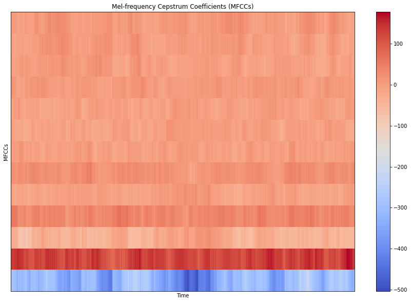

# Scriabin - A Music Genre Classifier

## Introduction

I've come across many people that have difficulties determining the music genre of a song when compared to identifying song names/artists. I built Scriabin to alleviate people of this stress. More specifically, I constructed a Convolutional Neural Network using **Tensorflow & Keras** that ingests the <a href="https://en.wikipedia.org/wiki/Mel-frequency_cepstrum"> Mel-frequency cepstrum coefficients </a> of audio snippets of songs which then returns a music genre prediction. The prediction is based on 10 possible genres (Blue, Classical, Country, Disco, Hip Hop, Jazz, Metal, Reggae and Rock). More importantly, my model exceeds <a href="https://arxiv.org/abs/1802.09697"> human accuracy</a> by 12%. 

## The Dataset

The model has been trained using the <a href="http://marsyas.info/downloads/datasets.htmland"> Marsyas dataset </a> which comprises of 1000 audio tracks each 30 seconds long, containing 10 genres (those mentioned previously), each represented by 100 tracks. The tracks are all 22050Hz Mono 16-bit audio files in .wav format.

## Why Mel-frequency Cepstrums Coefficients (MFCCs)?

MFCCs are signal features that are extracted from audio. They are a representation of short-term power spectrum which measure the intensity of the energy of a signal in a finite time interval. MFCCs currently have popular applications in speech recognition systems or in systems that recognize numbers spoken into telephones. Most notably, MFCCs have had increased use in music information retrieval related to music genre classification given that the can measure the intensity of sound with a time interval that may be characteristic of a musical genre. For example, the intensity of sound in rock music is strong and consistent when compared with classical musical which usually starts soft and climaxes by the end of the piece.    

Example: MFCC Spectogram

The information is commonly depicted with heat maps as observed above, with the intensity of the singal being represented by varying grades of color and brightness. MFCCs are derived, most importantly, by applying a <a href="https://en.wikipedia.org/wiki/Fourier_transform"> Fourier Transformation </a> over the audio file.

## How is the model served?

I currently serve the model via a simple Flask application. Users are prompted to provide a YouTube music video http link and Scriabin does the rest. 

## How did you extract the MFCCs?

I took advantage of <a href="https://librosa.org/doc/latest/index.html"> Librosa </a> which is a powerful Python package targeted towards audio analysis.

## Project Structure:

